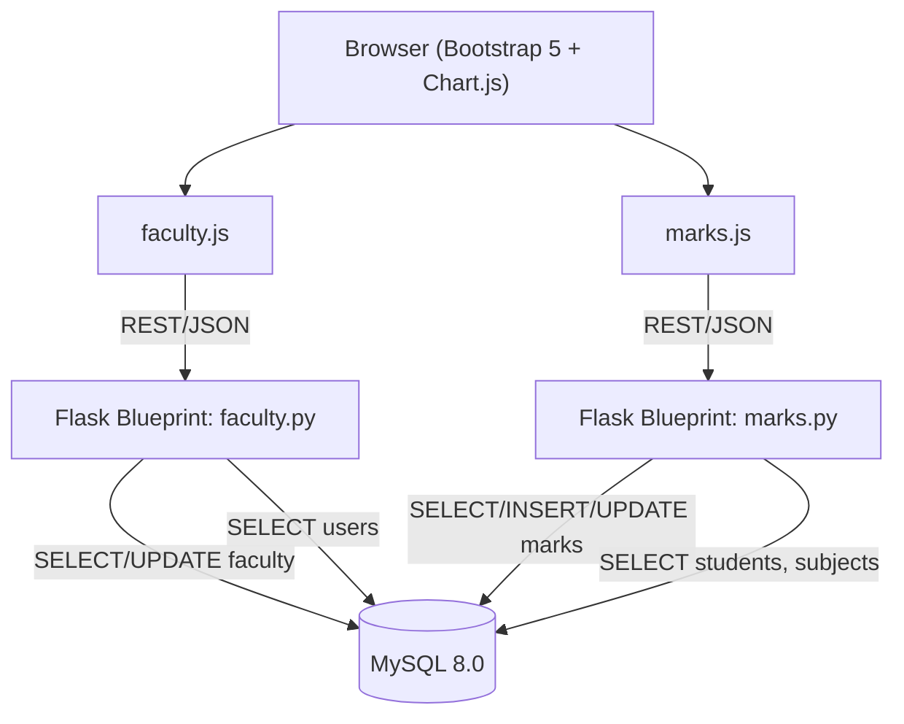

# Design Document: Faculty & Marks Module

## Overview

The Faculty & Marks Module (Member 2 — RAHUL branch) is a self-contained subsystem of the Student-Faculty Management System. It provides:

- Faculty profile viewing and updating
- A faculty dashboard with class/student-count summaries
- Marks entry and correction with automatic grade derivation
- Result generation via JOIN queries
- Performance visualization using Chart.js bar charts

The module owns two tables (`faculty`, `marks`) and reads from four shared tables (`users`, `students`, `subjects`, `student_subjects`). All write operations are strictly confined to the owned tables. The backend is split into two Flask blueprints (`faculty.py`, `marks.py`); the frontend into two JS files (`faculty.js`, `marks.js`) backed by three HTML templates.

---

## Architecture



### Request Flow

1. Browser loads an HTML template and the corresponding JS file.
2. JS file makes `fetch()` calls to Flask API endpoints.
3. Flask blueprint validates input, executes parameterized SQL, and returns JSON.
4. JS file renders the response into the DOM (or Chart.js canvas).

### Merge Safety Boundary

```
WRITE access:   faculty (Faculty_Service only)
                marks   (Marks_Service only)

READ access:    users, students, subjects, student_subjects
NO access:      feedback, attendance, alerts
```

---

## Components and Interfaces

### Backend: `faculty.py` (Flask Blueprint `faculty`)

| Route | Method | Description |
|---|---|---|
| `/faculty/dashboard` | GET | Returns faculty profile + class summary (subjects + student counts) |
| `/faculty/profile/<faculty_id>` | GET | Returns a single faculty record |
| `/faculty/profile/update` | POST | Updates `dept_id` and `designation` for a faculty record |

**Input / Output contracts**

`GET /faculty/profile/<faculty_id>`
- Response 200: `{ faculty_id, name, email, dept_id, designation }`
- Response 404: `{ error: "Faculty not found" }`

`POST /faculty/profile/update`
- Body: `{ faculty_id, dept_id, designation }`
- Response 200: `{ message: "Profile updated successfully" }`
- Response 404: `{ error: "Faculty not found" }`

`GET /faculty/dashboard`
- Query param: `faculty_id`
- Response 200:
```json
{
  "profile": { "faculty_id": 1, "name": "...", "dept_id": 2, "designation": "..." },
  "classes": [
    { "subject_id": 10, "subject_name": "...", "student_count": 35 }
  ]
}
```

---

### Backend: `marks.py` (Flask Blueprint `marks`)

| Route | Method | Description |
|---|---|---|
| `/marks/add` | POST | Inserts a new marks record |
| `/marks/update/<marks_id>` | PUT | Updates marks_obtained and recalculates grade |
| `/marks/results` | GET | Returns results for a subject + exam_type |
| `/marks/chart-data` | GET | Returns chart data (student_name, marks_obtained) |

**Input / Output contracts**

`POST /marks/add`
- Body: `{ student_id, subject_id, marks_obtained, exam_type }`
- Response 201: `{ message: "Marks added", marks_id: <new_id> }`
- Response 400: `{ error: "marks_obtained must be between 0 and 100" }`
- Response 404: `{ error: "Student not found" }` or `{ error: "Subject not found" }`

`PUT /marks/update/<marks_id>`
- Body: `{ marks_obtained }`
- Response 200: `{ message: "Marks updated", grade: "B" }`
- Response 400: `{ error: "marks_obtained must be between 0 and 100" }`
- Response 404: `{ error: "Marks record not found" }`

`GET /marks/results?subject_id=<id>&exam_type=<type>`
- Response 200: `[ { marks_id, student_name, subject_name, marks_obtained, grade, exam_type }, ... ]` (sorted by marks_obtained DESC)

`GET /marks/chart-data?subject_id=<id>&exam_type=<type>`
- Response 200: `[ { student_name, marks_obtained }, ... ]`

---

### Frontend: `faculty.js`

- On page load: calls `GET /faculty/dashboard` and populates profile card and class-summary table.
- On form submit (update profile): calls `POST /faculty/profile/update` and shows success/error toast.

### Frontend: `marks.js`

- Marks entry form: calls `POST /marks/add`; shows validation errors inline.
- Marks update form: calls `PUT /marks/update/<marks_id>`.
- Results view: calls `GET /marks/results` and renders a sortable HTML table.
- Chart view: calls `GET /marks/chart-data`, renders a Chart.js bar chart, and computes grade distribution summary client-side.

### HTML Templates

| Template | Purpose |
|---|---|
| `faculty_dashboard.html` | Profile card + class summary table |
| `add_marks.html` | Marks entry / update form |
| `marks_report.html` | Results table + Chart.js bar chart + grade distribution |

---

## Data Models

### Table: `faculty` (owned — CREATE)

```sql
CREATE TABLE faculty (
    faculty_id  INT AUTO_INCREMENT PRIMARY KEY,
    name        VARCHAR(100) NOT NULL,
    email       VARCHAR(100) UNIQUE,
    dept_id     INT,
    designation VARCHAR(50),
    FOREIGN KEY (email)    REFERENCES users(email),
    FOREIGN KEY (dept_id)  REFERENCES departments(dept_id)
);
```

### Table: `marks` (owned — CREATE)

```sql
CREATE TABLE marks (
    marks_id       INT AUTO_INCREMENT PRIMARY KEY,
    student_id     INT NOT NULL,
    subject_id     INT NOT NULL,
    marks_obtained DECIMAL(5,2) NOT NULL,
    grade          VARCHAR(2),
    exam_type      VARCHAR(50) NOT NULL,
    FOREIGN KEY (student_id) REFERENCES students(student_id),
    FOREIGN KEY (subject_id) REFERENCES subjects(subject_id)
);
```

### Grade Derivation Logic

```python
def derive_grade(marks: float) -> str:
    if marks >= 90: return "A"
    if marks >= 75: return "B"
    if marks >= 60: return "C"
    if marks >= 45: return "D"
    return "F"
```

### Read-Only Tables (SELECT only)

| Table | Columns used |
|---|---|
| `users` | `email` |
| `students` | `student_id`, `name` |
| `subjects` | `subject_id`, `subject_name` |
| `student_subjects` | not directly queried (class summary derived from `marks`) |

### Key SQL Queries (parameterized)

```sql
-- Dashboard: subjects + student counts for a faculty member
SELECT m.subject_id, s.subject_name, COUNT(DISTINCT m.student_id) AS student_count
FROM marks m
JOIN subjects s ON m.subject_id = s.subject_id
WHERE m.faculty_id = %s          -- if faculty_id added to marks, else filter by known subjects
GROUP BY m.subject_id, s.subject_name;

-- Results for a subject + exam_type
SELECT m.marks_id, st.name AS student_name, su.subject_name,
       m.marks_obtained, m.grade, m.exam_type
FROM marks m
JOIN students st ON m.student_id = st.student_id
JOIN subjects su ON m.subject_id = su.subject_id
WHERE m.subject_id = %s AND m.exam_type = %s
ORDER BY m.marks_obtained DESC;

-- Chart data
SELECT st.name AS student_name, m.marks_obtained
FROM marks m
JOIN students st ON m.student_id = st.student_id
WHERE m.subject_id = %s AND m.exam_type = %s;
```

---

## Correctness Properties

*A property is a characteristic or behavior that should hold true across all valid executions of a system — essentially, a formal statement about what the system should do. Properties serve as the bridge between human-readable specifications and machine-verifiable correctness guarantees.*

### Property 1: Faculty Profile Lookup Round-Trip

*For any* faculty record inserted into the `faculty` table, querying `GET /faculty/profile/<faculty_id>` should return a response whose `faculty_id`, `name`, `email`, `dept_id`, and `designation` fields exactly match the inserted record.

**Validates: Requirements 1.1**

---

### Property 2: Faculty Profile Update Round-Trip

*For any* existing faculty record and any valid `(dept_id, designation)` pair, calling `POST /faculty/profile/update` followed by `GET /faculty/profile/<faculty_id>` should return the updated `dept_id` and `designation` values.

**Validates: Requirements 1.2**

---

### Property 3: Dashboard Aggregation Accuracy

*For any* set of marks records associated with a faculty member, the dashboard response from `GET /faculty/dashboard` should (a) include the faculty's `name`, `dept_id`, and `designation`, (b) list exactly the distinct `subject_id` values present in those marks records, and (c) report a `student_count` per subject equal to the number of distinct `student_id` values for that subject in the marks records.

**Validates: Requirements 2.1, 2.2, 2.3**

---

### Property 4: Marks Range Validation

*For any* numeric value outside the closed interval [0, 100], both `POST /marks/add` and `PUT /marks/update/<marks_id>` should return HTTP 400 and leave the `marks` table unchanged.

**Validates: Requirements 3.2, 3.3, 4.3**

---

### Property 5: Grade Derivation Correctness

*For any* `marks_obtained` value in [0, 100], the `grade` stored after a successful insert or update should satisfy: ≥90 → "A", 75–89 → "B", 60–74 → "C", 45–59 → "D", 0–44 → "F". This property holds for both the initial insert path and the update/recalculation path.

**Validates: Requirements 3.6, 4.1**

---

### Property 6: Marks Insert Round-Trip

*For any* valid `(student_id, subject_id, marks_obtained, exam_type)` tuple, calling `POST /marks/add` should return HTTP 201 and the new record should be retrievable via `GET /marks/results` with the correct field values.

**Validates: Requirements 3.1**

---

### Property 7: Invalid ID Returns 404

*For any* request that references a `faculty_id`, `student_id`, `subject_id`, or `marks_id` that does not exist in the corresponding table, the relevant endpoint should return HTTP 404 and perform no write operations.

**Validates: Requirements 1.3, 3.4, 3.5, 4.2**

---

### Property 8: Result Completeness and Ordering

*For any* `subject_id` and `exam_type`, `GET /marks/results` should return exactly the set of marks records matching that combination (no more, no fewer), each enriched with `student_name` and `subject_name`, and the list should be sorted by `marks_obtained` in non-increasing order.

**Validates: Requirements 5.1, 5.2**

---

### Property 9: Chart Data Structure

*For any* `subject_id` and `exam_type`, every object in the JSON array returned by `GET /marks/chart-data` should contain both a `student_name` field (non-empty string) and a `marks_obtained` field (numeric value in [0, 100]).

**Validates: Requirements 6.2**

---

## Error Handling

| Scenario | HTTP Status | Response Body |
|---|---|---|
| `faculty_id` not found (GET profile) | 404 | `{ "error": "Faculty not found" }` |
| `faculty_id` not found (POST update) | 404 | `{ "error": "Faculty not found" }` |
| `student_id` not found (POST marks/add) | 404 | `{ "error": "Student not found" }` |
| `subject_id` not found (POST marks/add) | 404 | `{ "error": "Subject not found" }` |
| `marks_id` not found (PUT marks/update) | 404 | `{ "error": "Marks record not found" }` |
| `marks_obtained` out of range [0–100] | 400 | `{ "error": "marks_obtained must be between 0 and 100" }` |
| Missing required field in request body | 400 | `{ "error": "Missing required field: <field_name>" }` |
| Database connection error | 500 | `{ "error": "Internal server error" }` |

**General principles:**
- All validation runs before any SQL is executed — no partial writes.
- FK existence checks use `SELECT COUNT(*)` with parameterized queries before INSERT.
- All exceptions are caught at the blueprint level; raw tracebacks are never returned to the client.
- The frontend JS displays inline error messages for 400 responses and toast notifications for 404/500 responses.

---

## Testing Strategy

### Dual Testing Approach

Both unit tests and property-based tests are required. They are complementary:
- Unit tests cover specific examples, integration points, and edge cases.
- Property-based tests verify universal correctness across randomized inputs.

### Unit Tests

Focus areas:
- `derive_grade()` function: specific boundary values (0, 44, 45, 59, 60, 74, 75, 89, 90, 100).
- API endpoints: one happy-path example per endpoint.
- Error responses: one example per error condition (404, 400).
- Empty result set: `GET /marks/results` with no matching records returns `[]`.

### Property-Based Tests

**Library**: [`hypothesis`](https://hypothesis.readthedocs.io/) (Python) — do not implement PBT from scratch.

**Configuration**: Each property test must run a minimum of 100 examples (`@settings(max_examples=100)`).

**Tagging convention** — each test must include a comment:
```
# Feature: faculty-marks-module, Property <N>: <property_text>
```

| Property | Test Description | Hypothesis Strategy |
|---|---|---|
| P1 | Faculty profile lookup round-trip | `st.integers(min_value=1)` for faculty_id; insert then GET |
| P2 | Faculty profile update round-trip | `st.integers()` for dept_id, `st.text()` for designation |
| P3 | Dashboard aggregation accuracy | `st.lists(st.fixed_dictionaries({...}))` for marks records |
| P4 | Marks range validation | `st.floats().filter(lambda x: x < 0 or x > 100)` |
| P5 | Grade derivation correctness | `st.floats(min_value=0, max_value=100)` |
| P6 | Marks insert round-trip | `st.fixed_dictionaries({student_id, subject_id, marks_obtained, exam_type})` |
| P7 | Invalid ID returns 404 | `st.integers().filter(lambda x: x not in existing_ids)` |
| P8 | Result completeness and ordering | `st.lists(marks_record_strategy, min_size=1)` |
| P9 | Chart data structure | `st.lists(marks_record_strategy)` |

**Each correctness property must be implemented by exactly one property-based test.**

### Test File Layout

```
/tests/
  test_faculty_unit.py       # unit tests for faculty.py endpoints
  test_marks_unit.py         # unit tests for marks.py endpoints + derive_grade
  test_faculty_property.py   # Hypothesis property tests (P1, P2, P3, P7)
  test_marks_property.py     # Hypothesis property tests (P4, P5, P6, P7, P8, P9)
```
